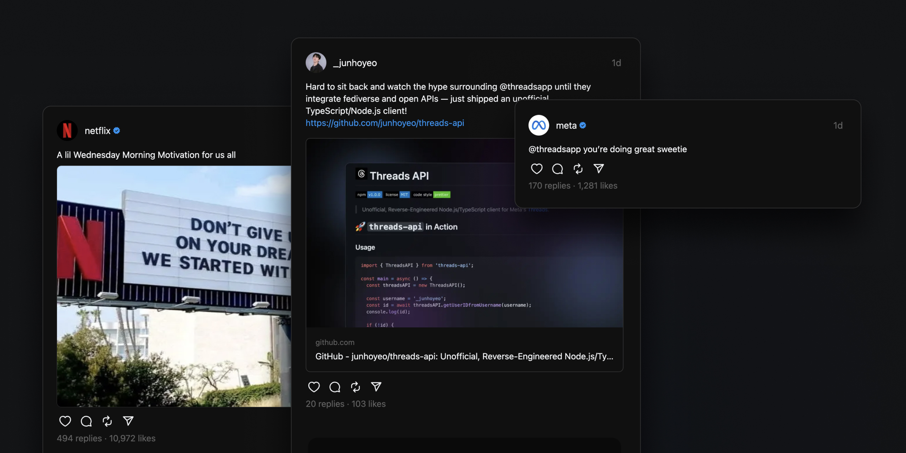

# react-threads

  

Embed Static Threads in your React/Next.js application. UI components for Meta's Threads. _Powered by **[junhoyeo/threads-api](https://github.com/junhoyeo/threads-api)**._

> **Warning** 
> **As of September 8, 2023, the development of the ["threads-api"](https://github.com/junhoyeo/threads-api) project have been halted and discontinued due to communication received from Meta Platforms, Inc. (“Meta,” previously known as Facebook, Inc.). This repository, which is related to the "threads-api" project, has also been archived and will no longer receive updates or maintenance.** The previous documentation related to this project has been moved to [PRESERVED.md](https://github.com/junhoyeo/react-threads/blob/main/PRESERVED.md) as requested.
>
> The "threads-api" was developed for educational and research purposes only. Based on the notification from Meta, it's clear that using or distributing the code might violate the terms of service of Meta Platforms, Inc. and its associated services, including but not limited to Instagram and Threads. Any actions or activities related to the material contained within this repository are solely the user's responsibility. The author and contributors of this repository do not support or condone any unethical or illegal activities.

