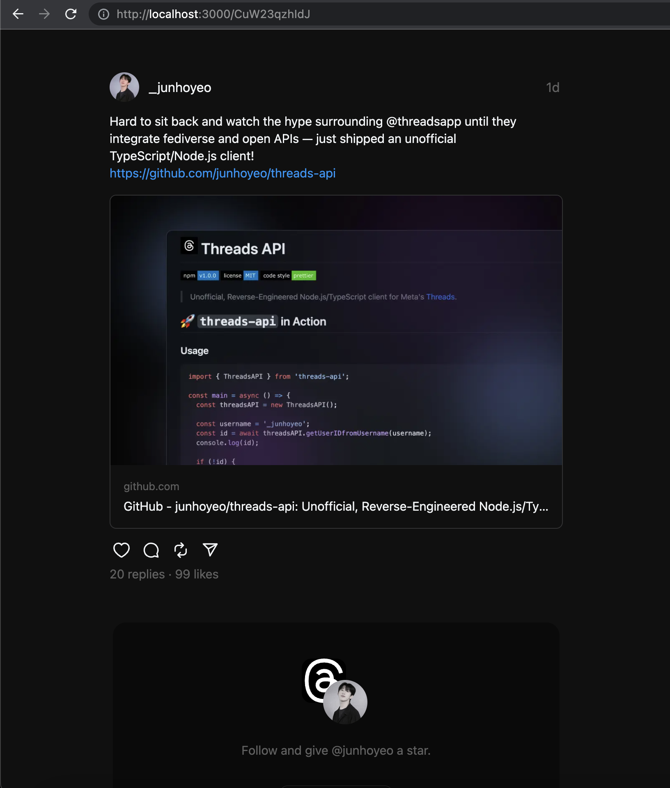

# react-threads

> Work in Progress. _Powered by **[junhoyeo/threads-api](https://github.com/junhoyeo/threads-api)**._

[](https://github.com/junhoyeo)

## 🚀 Usage

```typescript
import { GetStaticProps, NextPage } from 'next';
import { Thread as ThreadPost, ThreadsAPI } from 'threads-api';

// FIXME: Component library coming soon...
// import { BannerCTA } from '@/components/BannerCTA';
// import { Thread } from '@/components/Thread';

const threadsAPI = new ThreadsAPI();

type Props = {
  threadID: string;
  thread: ThreadPost;
};

export const getStaticProps: GetStaticProps<Props, { threadId: string }> = async (context) => {
  try {
    // const tweetAst = await fetchTweetAst(tweetId)
    const threadID = context.params?.threadId;
    if (!threadID) {
      console.log('[!] Thread ID not provided');
      return { notFound: true };
    }
    const postID = await threadsAPI.getPostIDfromThreadID(threadID);
    if (!postID) {
      console.log(
        '[!] Post ID not found with provided Thread ID (in threadsAPI.getPostIDfromThreadID):',
        threadID,
      );
      return { notFound: true };
    }
    const thread = await threadsAPI.getThreads(postID);
    const { containing_thread } = thread;

    return {
      props: {
        threadID,
        thread: containing_thread,
      },
      revalidate: 10,
    };
  } catch (err) {
    console.error('[*] Error fetching Thread', err);
    throw err;
  }
};

export async function getStaticPaths() {
  return {
    paths: ['/CuW23qzhIdJ'], // FIXME: Update `paths`
    fallback: true,
  };
}
```

## 🏴‍☠️ Useful Building Blocks

- Looking for an API client?
  - **[junhoyeo/threads-api ](https://github.com/junhoyeo/threads-api)**
- Using [_Private Git Submodules_](https://github.com/orgs/vercel/discussions/44) when deploying with Vercel?
  - **[junhoyeo/vercel-submodules ](https://github.com/junhoyeo/vercel-submodules)**

## 🏴‍☠️ Inspired from 🤍

- [vercel-labs/react-tweet](https://github.com/vercel-labs/react-tweet)
- [transitive-bullshit/react-static-tweets](https://github.com/transitive-bullshit/react-static-tweets)
- [zernonia/tweetic](https://github.com/zernonia/tweetic)

## License

<p align="center">
  <a href="https://github.com/junhoyeo">
    
  </a>
</p>

<p align="center">
  <strong>MIT © <a href="https://github.com/junhoyeo">Junho Yeo</a></strong>
</p>

If you find this project intriguing, **please consider starring it(⭐)** or following me on [GitHub](https://github.com/junhoyeo) (I wouldn't say [Threads](https://www.threads.net/@_junhoyeo)). I code 24/7 and ship mind-breaking things on a regular basis, so your support definitely won't be in vain.
